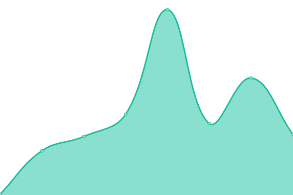
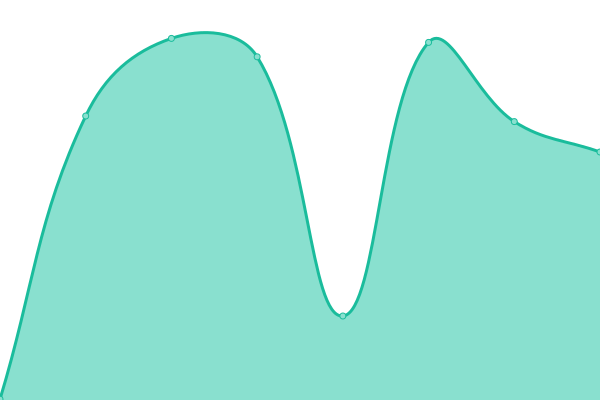

# [📈 Live Status](https://sashakarcz.github.io): <!--live status--> **🟧 Partial outage**

This repository contains the open-source uptime monitor and status page for Some Place.

With [Upptime](https://upptime.js.org), you can get your own unlimited and free uptime monitor and status page, powered entirely by a GitHub repository. We use [Issues](https://github.com/sashakarcz/uptime/issues) as incident reports, [Actions](https://github.com/sashakarcz/uptime/actions) as uptime monitors, and [Pages](https://sashakarcz.github.io) for the status page.

<!--start: status pages-->
<!-- This summary is generated by Upptime (https://github.com/upptime/upptime) -->
<!-- Do not edit this manually, your changes will be overwritten -->
<!-- prettier-ignore -->
| URL | Status | History | Response Time | Uptime |
| --- | ------ | ------- | ------------- | ------ |
|  [Google](https://www.google.com) | 🟩 Up | [google.yml](https://github.com/sashakarcz/uptime/commits/HEAD/history/google.yml) | 

 103ms
     
 | 

<a href="https://sashakarcz.github.io/uptime/history/google">100.00%</a>
    

|  [Wikipedia](https://en.wikipedia.org) | 🟩 Up | [wikipedia.yml](https://github.com/sashakarcz/uptime/commits/HEAD/history/wikipedia.yml) | 

 206ms
     
 | 

<a href="https://sashakarcz.github.io/uptime/history/wikipedia">100.00%</a>
    

|  [Hacker News](https://news.ycombinator.com) | 🟩 Up | [hacker-news.yml](https://github.com/sashakarcz/uptime/commits/HEAD/history/hacker-news.yml) | 

 317ms
     
 | 

<a href="https://sashakarcz.github.io/uptime/history/hacker-news">100.00%</a>
    

|  [Example](https://example.com) | 🟩 Up | [example.yml](https://github.com/sashakarcz/uptime/commits/HEAD/history/example.yml) | 

 51ms
     
 | 

<a href="https://sashakarcz.github.io/uptime/history/example">100.00%</a>
    

|  [Test Site](https://test.com) | 🟥 Down | [test-site.yml](https://github.com/sashakarcz/uptime/commits/HEAD/history/test-site.yml) | 

 2761ms
     
 | 

<a href="https://sashakarcz.github.io/uptime/history/test-site">100.00%</a>
    

|  [DNS Check - hidewall.io](https://hidewall.io) | 🟥 Down | [dns-check-hidewall-io.yml](https://github.com/sashakarcz/uptime/commits/HEAD/history/dns-check-hidewall-io.yml) | 

 191ms
     
 | 

<a href="https://sashakarcz.github.io/uptime/history/dns-check-hidewall-io">0.02%</a>
    

|  [DNS Check - example.com](http://dns-check.example.com) | 🟥 Down | [dns-check-example-com.yml](https://github.com/sashakarcz/uptime/commits/HEAD/history/dns-check-example-com.yml) | 

 0ms
     
 | 

<a href="https://sashakarcz.github.io/uptime/history/dns-check-example-com">0.00%</a>
    

|  [DNS Check - test.com](http://dns-check.test.com) | 🟥 Down | [dns-check-test-com.yml](https://github.com/sashakarcz/uptime/commits/HEAD/history/dns-check-test-com.yml) | 

 0ms
     
 | 

<a href="https://sashakarcz.github.io/uptime/history/dns-check-test-com">2.13%</a>
    

|  [DNS Check - mail.example.com](http://dns-check.mail.example.com) | 🟥 Down | [dns-check-mail-example-com.yml](https://github.com/sashakarcz/uptime/commits/HEAD/history/dns-check-mail-example-com.yml) | 

 0ms
     
 | 

<a href="https://sashakarcz.github.io/uptime/history/dns-check-mail-example-com">0.01%</a>
    

## Live DNS Status

| Domain           | Status     | Expected         | Actual           | Timestamp              |
|------------------|------------|------------------|------------------|------------------------|
| hidewall.io | Down | 104.21.32.197, 172.67.154.114 | 172.67.154.114, 104.21.32.197 | 2024-10-25T15:04:36.244100 |
| example.com | Up | 93.184.215.14 | 93.184.215.14 | 2024-10-25T15:04:36.266950 |
| test.com | Down | 192.0.2.1 | 3.18.255.247, 34.224.149.186 | 2024-10-25T15:04:36.366737 |
| mail.example.com | Down | mail.example.net | No record found | 2024-10-25T15:04:36.412169 |

<!--end: status pages-->

[**Visit our status website →**](https://sashakarcz.github.io)

### DNS Check on 2024-10-25T15:04:36.414685

